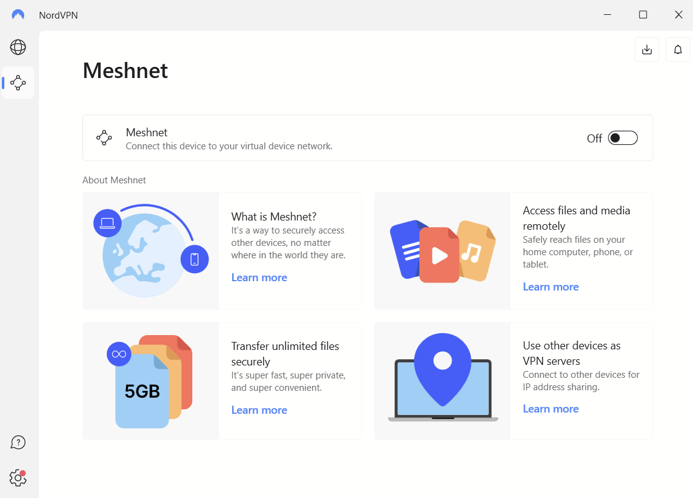
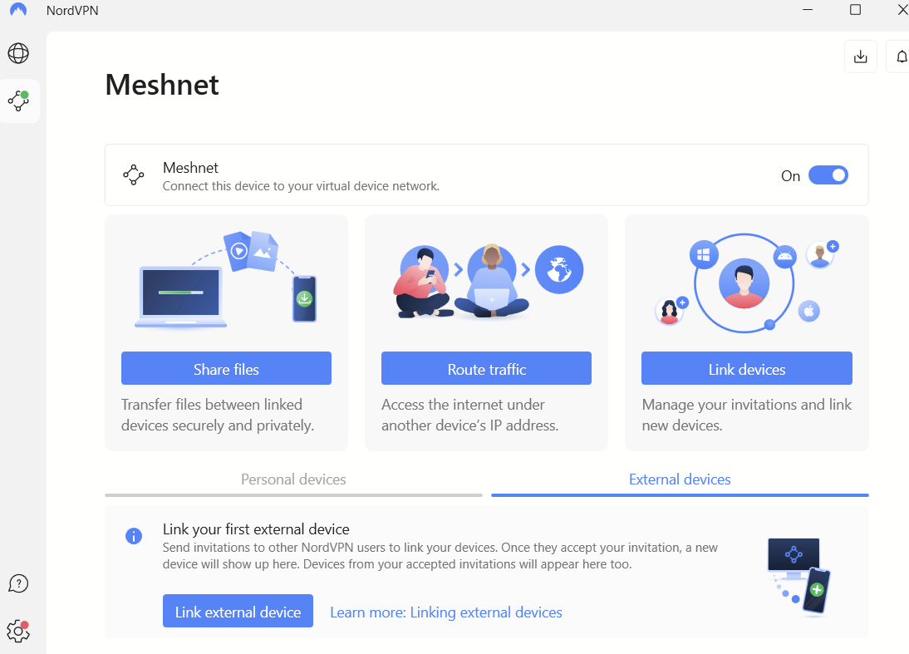
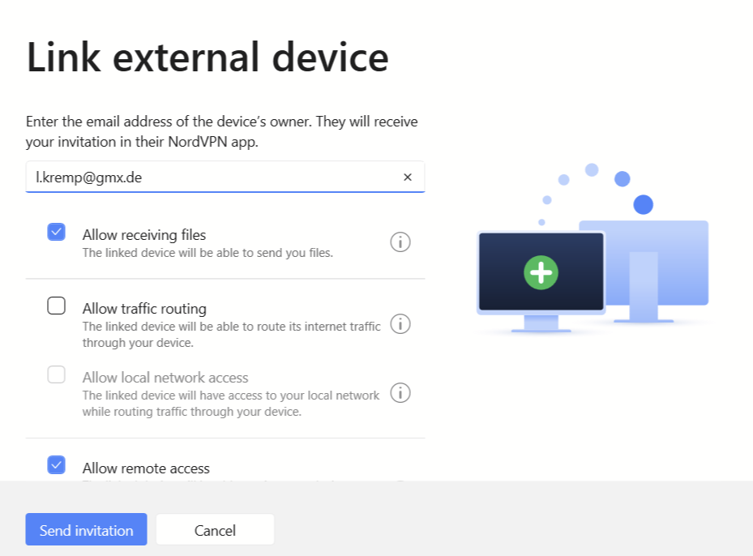
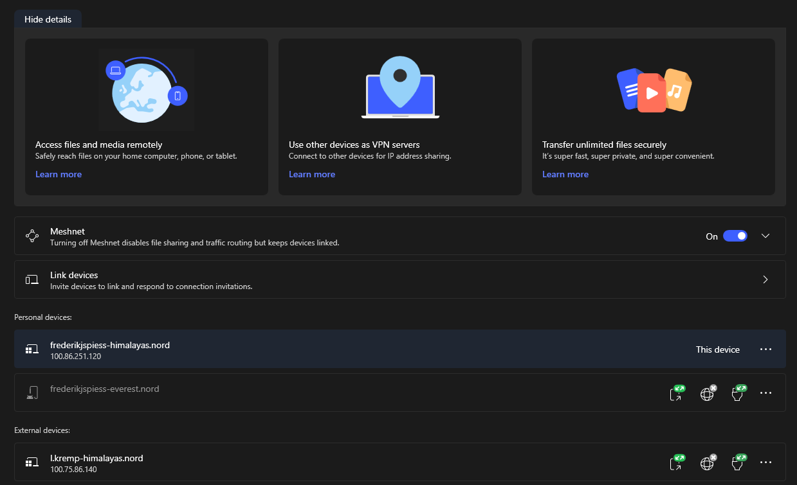
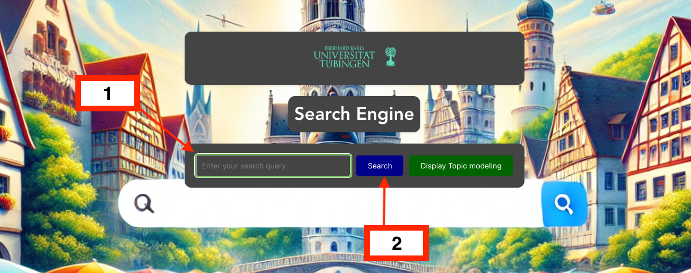

# ModernSearchEngines
ModernSearchEngines contains the code to the final project to the course Modern Search Engines (INFO-4271) at the University of Tübingen. This project is a search engine that retrieves English related content about Tübingen.

## Setup

### Dependencies
The project is built using python for backend and NodeJS for frontend. The python dependencies are listed in `requirements.txt`.

### Installation
Run:
```
git clone https://github.com/KTV02/ModernSearchEngines.git
```

### Remote Database Setup
To get access to the index stored on our database, follow the steps below:

1. Create a free NordVPN Account [here](https://nordvpn.com) (you don't even need the 30-day free trial, you just need the free account).
2. [Download](https://nordvpn.com/download/) the app on the device you want to use (For Linux, there is also a CLI version).
3. Enable Meshnet:
   
4. Click on External Device > Link External Device:
   
5. Enter email address: l.kremp@gmx.de
6. Allow the first and last options (sending and receiving):
   
7. Send the invitation and notify l.kremp@gmx.de.
8. Now you can see the IP address / hostname of the server under the tab "External Devices".
   

## Usage
To run the web interface of the search engine on localhost proceed as follows:
1. Go inside ./NLP/ and run the UIInterface class. `cd ./NLP && python UIInterface.py`
2. Go inside ./UI/search_engine_ui `cd ./UI/search_engine_ui`. Do `npm install`. Then `npm run serve`
3. Enter search query (1) and hit "Search" (2)


## Folder Structure

```markdown
ModernSearchEngines
├── GeoIRLK
│   └── distanceToTuebingenScorer.py
├── NLP
│   ├── KeywordFilter.py
│   ├── NLPOutput.txt
│   ├── NLPPipeline.py
│   ├── UIInterface.py
│   ├── final_results.csv
│   └── topicmodelingoutput.txt
├── README.md
├── UI
│   ├── READMEvue.txt
│   ├── package-lock.json
│   ├── search_engine_ui
│   │   ├── README.md
│   │   ├── babel.config.js
│   │   ├── jsconfig.json
│   │   ├── node_modules
│   │   ├── package-lock.json
│   │   ├── package.json
│   │   ├── public
│   │   │   ├── favicon.ico
│   │   │   └── index.html
│   │   ├── src
│   │   │   ├── App.vue
│   │   │   ├── assets
│   │   │   │   ├── background.webp
│   │   │   │   ├── logo.png
│   │   │   │   └── logoUni.png
│   │   │   ├── components
│   │   │   │   ├── HomePage.vue
│   │   │   │   ├── ImportPage.vue
│   │   │   │   ├── LinkedBoxes.vue
│   │   │   │   ├── Modal_component.vue
│   │   │   │   ├── SearchComponent.vue
│   │   │   │   ├── TreeComponent.vue
│   │   │   │   └── TreeNodeComponent.vue
│   │   │   ├── main.js
│   │   │   └── router
│   │   │       └── index.js
│   │   └── vue.config.js
│   └── topicTree.py
├── pipeline.drawio
├── readme
│   ├── file_structure.md
│   ├── readme1.png
│   ├── readme2.png
│   ├── readme3.png
│   └── readme4.png
├── retriever
│   ├── bm25.py
│   ├── bm25_cache.pkl
│   ├── compute_features.py
│   ├── data
│   │   ├── X.csv
│   │   ├── groups.csv
│   │   └── y.csv
│   ├── final_results.csv
│   ├── lgb_ranker_model1.txt
│   ├── output.txt
│   ├── query_preprocessor.py
│   ├── results
│   ├── topicmodelling.py
│   ├── vectorspace.py
│   ├── vectorspaceintersection.py
│   ├── xgb_ranker_model.json
└── webcrawler
    ├── NLPforKeywords_RAKE_NER.py
    ├── NLPforKeywords_TOPIC_MODELLING.py
    ├── crawler.py
    ├── createDatabaseOverview.py
    ├── localCrawler.py
    ├── pagerank.py
    ├── recheckKeyword.py
    ├── sync_database.py

```

## License
[MIT](https://choosealicense.com/licenses/mit/)